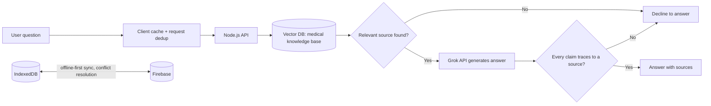

# MyHealthApp

**An AI health assistant that answers from its sources, or doesn't answer.**

· [60-second walkthrough]

## The problem

Health is the worst place for an LLM to guess. A confident wrong answer is worse than no answer, so this app is built around one rule: every claim must trace to a retrieved source. If it can't, the app declines.

## How it works

## Evaluation results

| Metric | Result | How it was measured |
|---|---|---|
| Unconstrained generation paths | **45% fewer** | 10,000+ curated test cases, automated assertions plus a human feedback loop. "Failure" = answer with no supporting source. Failures fell from 1,120 to 615. |
| Questions answered with no relevant retrieval | **20 of 100** before the fix, **7 of 100** after | n=100 queries from internal QA logs; counted by manual relevance judgment and retrieval overlap. Small sample. |
| p95 latency | **under 800 ms** (from ~1,950 ms) | Locust, 50,000 requests, 100 concurrent users, 25% repeated queries. Measures [time to first token / full response]. Script in /load-tests. |
| Redundant API calls | **60% fewer** | Over 30 days of logs: 200 →80  duplicate calls, counted by unique input-hash IDs. |

## What broke (and what I changed)

Early on, the model answered 20 of 100 medical questions even when retrieval returned nothing relevant. The test suite flagged it, so I added a rule that every claim must trace to a retrieved source. If it can't, the app declines instead of guessing.

## Tech stack

Node.js · Grok API · Vector DB · IndexedDB · Firebase

## Status

[Live with 500+ active users, as of October 2026.] 

[Known limitations: The medical knowledge base was extensive but not exhaustive. Rare conditions or newly published research weren’t always captured, so the pipeline occasionally returned incomplete answers.]
